# History of Holy Trinity Anglican Church

## The Early Days

The early settlers in Ijede were predominantly fishermen. In the course of their trade at Ebute Ero, they were introduced to Christianity. Consequently, they began worshipping at Holy Trinity Anglican Church, Ebute Ero, traveling in canoes across the Lagos Lagoon.

During one of their journeys to Ebute Ero for Sunday service, tragedy struck — their boat capsized, and some members lost their lives in the accident. However, instead of having their faith dampened, they emerged stronger, resolving to start a church in Ijede rather than continue crossing the lagoon for worship services.

The church was founded on **24th April 1890**.

## Founding Values and Members

The founding fathers are credited with very strong Christian values, which included:

- Marriage to non-members was prohibited in the church.
- The promotion of undiluted Christian faith.

**Hannah Olayinka** was the key proponent of bringing the church to Ijede. A set of parishioners baptized at Ebute Ero includes:

- Pa. Daniel Jomuken  
- Pa. Alfred Oloko  
- Mama Aina Dorcas (*1st Iya Ijo*)

## The Early Church

The church's values attracted many members of the community to the house of the Lord. **Mama Aina Dorcas**, who was baptized at Ebute Ero, became the first *Iya Ijo* until her death in 1964.

Notable lay readers of the early church include:

1. **Peter Oloko** – son of Pa. Alfred Oloko, the first lay reader  
2. **Pa Solomon Odedina** – the second lay reader  
3. **Late Can. Taiwo Olupitan** – third lay reader, son of Pa Joseph Akintola Duduyemi Olupitan (the *Igba keji Baba Ijo*)  
4. **Pa Festus Fanuga** – fourth lay reader  
5. **Pa Olu Sholabomi** – fifth lay reader

The commitment of church members helped in its growth. Prominent among them:

- **Pa Osho Emmanuel Olaleye**, third *Baba Ijo*, whose daughter, **Mama Bisi Olaleye**, built the current church auditorium and vicarage  
- **Mama Elizabeth Oloko**, second *Iya Ijo* (1965–1983)  
- **Pa Banjo**, first church treasurer and warden  
- **Pa Ezikiel Adenuga**, the longest-serving warden  
- **Pa James Ifetade Katola**, who served as the *Balogun Ijo*  
- **Mama Esther Adebola Jomuken**, who was blind but could recite the Bible, hymns, and anthems clearly and fluently

## The Contemporary Church

The church has since grown to become the **Ijede Archdeaconry** seat.

- **Venerable E. Alieu** – first Administrator of Ijede Archdeaconry  
- **Venerable B. Dokunmu** – promoted to Archdeacon by the Lord Bishop of Lagos West, Right Rev. Olusola Odedeji. Under his tenure, the church experienced spiritual revival and growth in all churches within the archdeaconry.  
- **Ven. Johnson Ajayi** – helped nurture church investments and initiated the building of **Bisi Olaleye Nursery and Primary School**  
- **Late Canon Micheal Obembe** – planted over five churches as the church vicar

---

What more can we say of the contributions of the past priests and their roles in the growth of the church? 

> *"Paul plants and Apollos waters, but the Lord giveth the increase."*

<h1>Meet Our Founders</h1>

  
  

    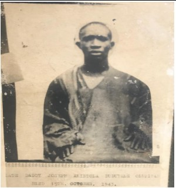
    
<strong>Pa Joseph Akintola Duduyele OLUPITAN</strong> <em>One of the Founders of the Church</em>

  

  

    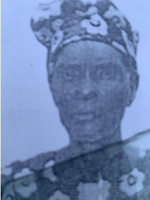
    
<strong>Pa Eniayewu Oyebo</strong> <em>One of the Founders of the Church</em>

  

  

    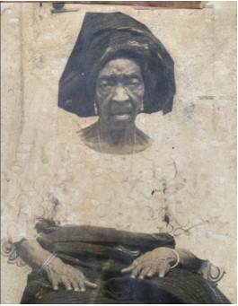
    
<strong>Mama Elizabeth Folaranmi Oloko</strong> <em>2nd Iya  Ijo</em>

  

  

    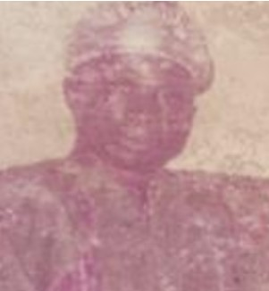
    
<strong>....</strong> <em>One of the Founders of the Church</em>

  

  

    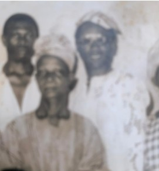
    
<strong>Pa Ruben Sholabomi</strong> <em>AKA Baba Olodun metala</em>

  

  

    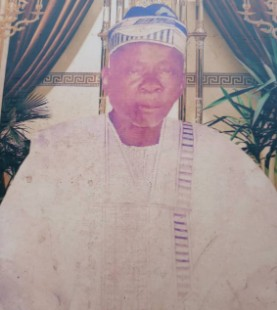
    
<strong>Pa Oloko</strong> <em>...</em>

  

  

    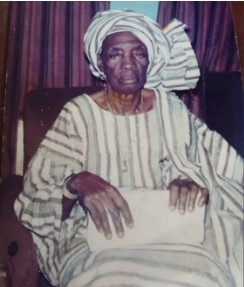
    
<strong>...</strong> <em>...</em>

  

  

    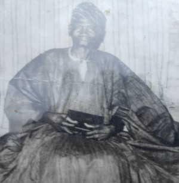
    
<strong>Pa Isaiah Abiodun</strong>

  

  

    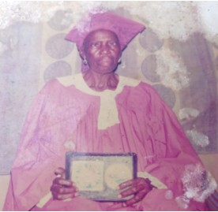
    
<strong>Madam Esther Jomuken</strong> <em>AKA Iya Bokonisha</em>

  

  

    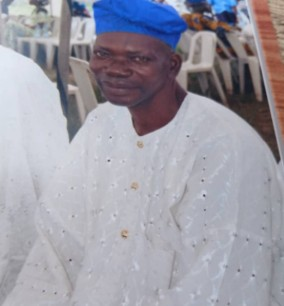
    
<strong>Pa Amos Adekunle Abiodun</strong>

  

  

    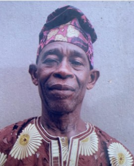
    
<strong>Mr. Olupitan</strong> <em>Long Serving Sexton</em>

  

